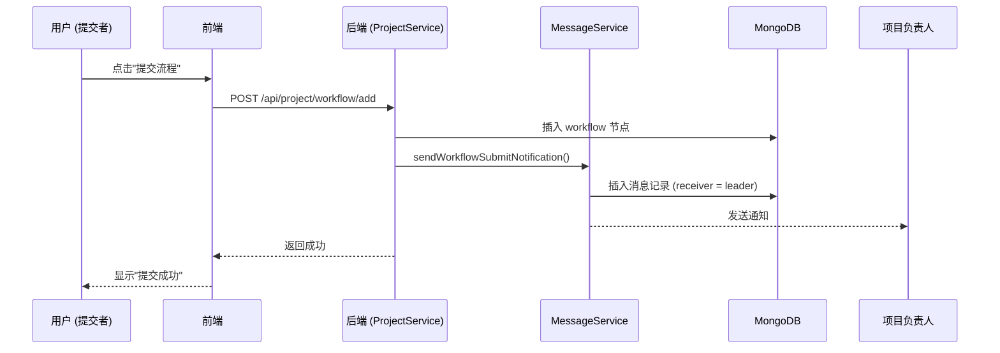
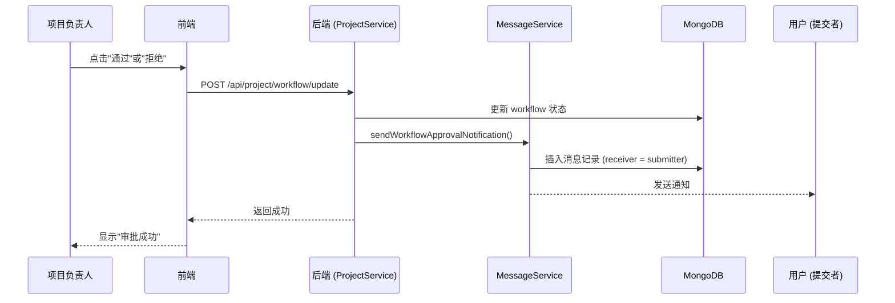

# 消息通知系统使用说明

## 📋 概述

消息通知系统允许团队成员在流程审批等关键业务操作时收到实时通知。当用户提交流程或审批流程时，相关人员会自动收到消息通知。

---

## 🎯 功能特性

### 1. **自动消息通知**
- ✅ **提交流程时**：向项目负责人发送"新流程待审批"通知
- ✅ **审批通过时**：向提交者发送"流程已通过"通知
- ✅ **审批拒绝时**：向提交者发送"流程已拒绝"通知

### 2. **消息管理**
- 📥 查看消息列表（支持分页）
- 🔍 筛选消息（全部/未读/已读）
- ✓ 标记单条消息为已读
- ✓✓ 标记所有消息为已读
- 🗑️ 删除消息
- 🔢 显示未读消息数量

### 3. **用户体验**
- 📱 响应式设计，适配各种屏幕
- 🎨 美观的 UI 界面
- ⚡ 下拉刷新和上拉加载更多
- 🔔 TabBar 角标显示未读数量

---

## 🏗️ 系统架构

### 后端组件

#### 1. **MessageService** (`api/services/MessageService.js`)
核心服务层，负责：
- 创建消息
- 查询消息列表
- 标记消息已读
- 删除消息
- 获取未读数量
- 发送 workflow 通知

#### 2. **MessageController** (`api/controllers/MessageController.js`)
控制器层，处理 HTTP 请求：
- `POST /api/message/list` - 获取消息列表
- `POST /api/message/mark-read` - 标记消息已读
- `POST /api/message/mark-all-read` - 标记所有消息已读
- `POST /api/message/delete` - 删除消息
- `GET /api/message/unread-count` - 获取未读数量

#### 3. **路由注册** (`api/routes/message.js`)
定义 API 端点并注册到主应用。

### 前端组件

#### 1. **messages 页面** (`pages/messages/`)
- `messages.js` - 页面逻辑
- `messages.wxml` - 页面结构
- `messages.wxss` - 页面样式

---

## 💾 数据结构

### MongoDB `messages` 集合

```javascript
{
  _id: ObjectId("..."),              // MongoDB 自动生成的物理主键
  message_id: "msg-1712649600000-abc12",  // 业务主键（唯一标识）
  type: "workflow_submit",           // 消息类型
  title: "新流程待审批",              // 消息标题
  content: "张三 提交了新的流程节点："提交申请"，请及时审批",  // 消息内容
  project_id: "proj-xxx",            // 关联项目ID
  project_name: "测试项目",           // 项目名称（冗余字段，便于显示）
  sender_uuid: "u-001",              // 发送者UUID
  receiver_uuid: "u-002",            // 接收者UUID
  related_step_id: "step-xxx",       // 关联的流程步骤ID（可选）
  is_read: false,                     // 是否已读
  created_at: "2026-04-12T10:00:00.000Z"  // 创建时间
}
```

### 消息类型

| 类型 | 说明 | 图标 | 触发时机 |
|------|------|------|----------|
| `workflow_submit` | 流程提交 | 📝 | 用户提交流程节点时 |
| `workflow_approve` | 流程通过 | ✅ | 负责人审批通过时 |
| `workflow_reject` | 流程拒绝 | ❌ | 负责人审批拒绝时 |

---

## 🔄 工作流程

### 场景 1：用户提交流程



### 场景 2：负责人审批流程



---

## 🚀 部署步骤

### 1. 本地开发环境

```bash
# 进入后端目录
cd miniprogram-server

# 安装依赖（如果需要）
npm install axios

# 启动本地服务器（如果尚未启动）
node api/index.js

# 运行测试脚本
node scripts/test-message-notification.js
```

### 2. 部署到 Vercel

```bash
# 进入后端目录
cd miniprogram-server

# 部署到生产环境
vercel --prod
```

### 3. 验证部署

访问健康检查接口确认服务正常：
```
https://miniprogram-server.vercel.app/api/health
```

---

## 🧪 测试方法

### 方法 1：使用测试脚本

```bash
cd miniprogram-server/scripts
node test-message-notification.js
```

### 方法 2：手动测试流程

#### 步骤 1：提交流程
1. 以普通成员身份登录
2. 进入项目详情或管理页面
3. 点击"➕ 提交流程"
4. 输入操作描述（如"提交申请"）
5. 点击确定

**预期结果**：
- ✅ 显示"提交流程成功"
- ✅ 项目负责人收到消息通知

#### 步骤 2：查看消息
1. 切换到项目负责人账号
2. 点击底部导航栏的"消息"Tab
3. 查看消息列表

**预期结果**：
- ✅ 看到一条"新流程待审批"消息
- ✅ 消息显示提交者、操作描述、项目名称
- ✅ 消息左侧有蓝色边框（未读标记）
- ✅ 右上角有红色圆点

#### 步骤 3：审批流程
1. 在项目页面找到待处理的流程节点
2. 点击"✓ 通过"或"✗ 拒绝"
3. 确认操作

**预期结果**：
- ✅ 显示"已通过"或"已拒绝"
- ✅ 流程节点状态更新
- ✅ 提交者收到审批结果通知

#### 步骤 4：查看审批结果
1. 切换回提交者账号
2. 进入消息页面

**预期结果**：
- ✅ 看到一条"流程已通过"或"流程已拒绝"消息
- ✅ TabBar 上有未读角标

#### 步骤 5：标记消息已读
1. 点击任意消息
2. 或点击"全部已读"按钮

**预期结果**：
- ✅ 消息变为灰色（已读状态）
- ✅ 红色圆点消失
- ✅ 未读数量减少

---

## 📊 API 接口文档

### 1. 获取消息列表

**接口**: `POST /api/message/list`

**请求体**:
```json
{
  "uuid": "u-002",
  "page": 1,
  "pageSize": 20,
  "is_read": false  // 可选：true=已读, false=未读, 不传=全部
}
```

**响应**:
```json
{
  "status": "success",
  "data": {
    "messages": [
      {
        "message_id": "msg-1712649600000-abc12",
        "type": "workflow_submit",
        "title": "新流程待审批",
        "content": "张三 提交了新的流程节点："提交申请"，请及时审批",
        "project_id": "proj-xxx",
        "project_name": "测试项目",
        "sender_uuid": "u-001",
        "receiver_uuid": "u-002",
        "related_step_id": "step-xxx",
        "is_read": false,
        "created_at": "2026-04-12T10:00:00.000Z"
      }
    ],
    "total": 5,
    "page": 1,
    "pageSize": 20
  }
}
```

---

### 2. 标记消息为已读

**接口**: `POST /api/message/mark-read`

**请求体**:
```json
{
  "message_id": "msg-1712649600000-abc12",
  "uuid": "u-002"
}
```

**响应**:
```json
{
  "status": "success",
  "data": {
    "message_id": "msg-1712649600000-abc12",
    "is_read": true
  }
}
```

---

### 3. 标记所有消息为已读

**接口**: `POST /api/message/mark-all-read`

**请求体**:
```json
{
  "uuid": "u-002"
}
```

**响应**:
```json
{
  "status": "success",
  "data": {
    "marked_count": 5
  }
}
```

---

### 4. 删除消息

**接口**: `POST /api/message/delete`

**请求体**:
```json
{
  "message_id": "msg-1712649600000-abc12",
  "uuid": "u-002"
}
```

**响应**:
```json
{
  "status": "success",
  "data": {
    "message_id": "msg-1712649600000-abc12",
    "deleted": true
  }
}
```

---

### 5. 获取未读消息数量

**接口**: `GET /api/message/unread-count?uuid=u-002`

**响应**:
```json
{
  "status": "success",
  "data": {
    "unread_count": 3
  }
}
```

---

## ⚠️ 注意事项

### 1. **权限控制**
- ✅ 用户只能查看自己的消息（通过 `receiver_uuid` 过滤）
- ✅ 用户只能标记自己的消息为已读
- ✅ 用户只能删除自己的消息

### 2. **性能优化**
- 📄 支持分页加载，默认每页 20 条
- 🔄 下拉刷新和上拉加载更多
- 💾 本地缓存消息列表，减少网络请求

### 3. **错误处理**
- 🔍 详细的日志记录（使用 Logger）
- ⚠️ 友好的错误提示
- 🛡️ 防御性编程（检查参数有效性）

### 4. **扩展性**
- 🔧 易于添加新的消息类型
- 📦 模块化设计，便于维护
- 🌐 支持未来扩展到推送通知

---

## 🐛 常见问题

### Q1: 消息没有显示？
**A**: 检查以下几点：
1. 确认用户 UUID 是否正确
2. 查看后端日志是否有错误
3. 检查 MongoDB 中 `messages` 集合是否有数据
4. 确认网络连接正常

### Q2: 未读数量不准确？
**A**: 
1. 刷新页面重新加载
2. 检查是否有其他设备标记了消息为已读
3. 查看控制台日志中的未读数量

### Q3: 消息通知没有发送？
**A**:
1. 检查 ProjectService 中是否正确初始化了 MessageService
2. 查看后端日志中是否有"发送通知"相关日志
3. 确认项目负责人 UUID 是否正确

### Q4: TabBar 角标不显示？
**A**:
1. 确认 messages 页面在 tabBar 中的索引是否正确（代码中是 index: 3）
2. 检查 app.json 中是否配置了 tabBar
3. 确认未读数量大于 0

---

## 📝 后续优化建议

### 短期优化
1. ✨ 添加消息声音提醒
2. 🔔 实现微信模板消息推送
3. 📱 添加消息详情页面
4. 🎯 支持点击消息跳转到相关项目

### 长期优化
1. 🤖 实现消息聚合（相同类型的消息合并显示）
2. 📊 添加消息统计分析
3. 🔍 支持消息搜索
4. 🌍 国际化支持

---

## 📞 技术支持

如有问题，请查看：
- 后端日志：Vercel Dashboard -> Logs
- 前端日志：微信开发者工具 -> Console
- 数据库：MongoDB Compass 连接 Atlas

---

**最后更新**: 2026-04-12  
**版本**: v1.0
